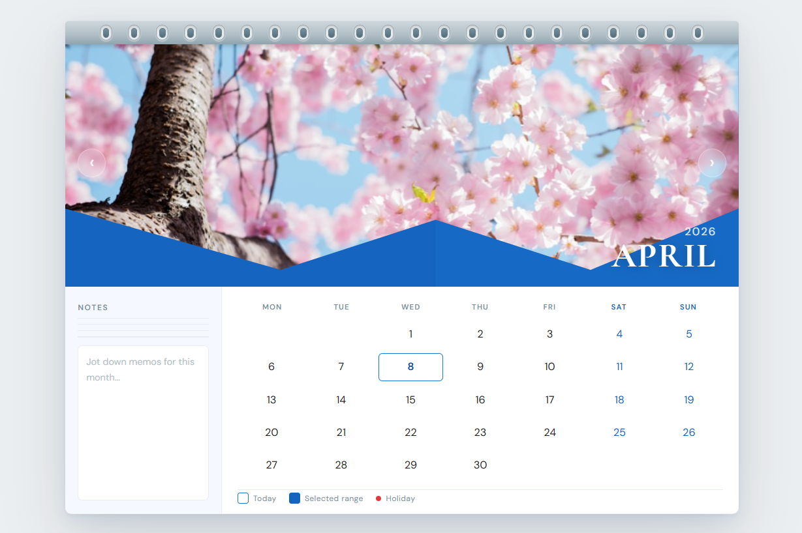

# Wall Calendar — Interactive React Component

A polished, interactive wall calendar component built with **React + Vite + CSS Modules**, faithfully translated from the physical calendar aesthetic in the design brief.



---

## ✨ Features

| Feature | Details |
|---|---|
| **Wall calendar aesthetic** | Spiral binding strip, hero image panel, blue geometric chevron overlay |
| **Month slide animation** | Smooth directional slide on month change (CSS keyframes) |
| **Day range selector** | Click once → start date; click again → end date; visual states for start, in-range, end, hover preview |
| **Holiday markers** | US federal + floating holidays (MLK Day, Memorial Day, Thanksgiving…) with red dot indicators |
| **Notes panel** | Month-scoped textarea, persisted in `localStorage`. Range label & day-count badge appear when a range is selected |
| **Responsive** | Desktop (side-by-side panels) → Tablet (stacked, notes row) → Mobile (compact touch-friendly grid) |
| **Seasonal images** | Curated Unsplash photo per month, changes with every navigation |

---

## 🗂 Project Structure

```
wall-calendar/
├── index.html
├── vite.config.js
├── package.json
└── src/
    ├── index.css           # Global reset
    ├── main.jsx            # React root
    ├── App.jsx             # App wrapper
    └── components/
        └── WallCalendar/
            ├── index.jsx            # Re-export
            ├── WallCalendar.jsx     # Root + sub-components
            ├── WallCalendar.module.css
            ├── constants.js         # Month images, holiday rules
            └── dateUtils.js         # Pure date helpers
```

---

## 🚀 Getting Started

```bash
# 1. Clone / download this repo
git clone https://github.com/HarshDhoriyani/wall-calendar.git
cd wall-calendar

# 2. Install dependencies
npm install

# 3. Run in development
npm run dev

# 4. Build for production
npm run build
```

Requires **Node.js ≥ 18**.

---

## 🎨 Design Decisions

### Aesthetic Direction
The component faithfully emulates the physical wall calendar from the reference image:
- **Spiral binding** — repeated "coil hole" elements in a metallic strip across the top.
- **Hero image** — full-bleed photograph that changes per month (Unsplash CDN).
- **Blue chevron wave** — an SVG `<path>` that creates the same distinctive zigzag geometric cutout as the reference, rendered in `#1565C0` (Material Blue 800).
- **Month badge** — Cormorant Garamond (editorial serif) for the large month name; DM Sans for body text.

### Range Selection UX
| Click | Action |
|---|---|
| 1st click on any day | Sets **start date**; hover preview activates |
| 2nd click | Sets **end date**; range locked in |
| Any further click | Resets and starts a new range |

Dates automatically swap if the end is earlier than the start.

### State Management
All state is local React state — no external libraries. Notes are persisted client-side via `localStorage` with a silent fallback on quota errors. Holiday data is computed from a set of rule functions (nth-weekday helpers) rather than a hardcoded flat list, so the calendar stays accurate across years.

---

## 🛠 Customisation

### Swap hero images
Edit `src/components/WallCalendar/constants.js` → `MONTH_IMAGES` array with any image URLs you prefer.

### Add / edit holidays
Edit `FIXED_HOLIDAYS` or the `getHolidayMap` function in `constants.js`. Return value is a plain object: `{ "YYYY-M-D": "Holiday Name" }`.

### Change the colour palette
All design tokens live at the top of `WallCalendar.module.css` in the `:root` block.

---

## 🧪 Evaluation Notes

- **No backend, no API** — purely frontend per spec.
- `localStorage` is the only persistence layer; all data stays in the browser.
- Images are loaded from Unsplash CDN — an internet connection is required to display hero photos (the calendar grid works fully offline).
- Tested at 320px (iPhone SE), 375px, 768px, 1024px, 1440px viewports.

---

## 📄 License

MIT — free to use, modify, and distribute.
